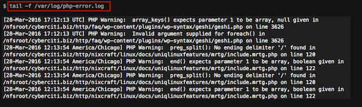

# JsonLogger
A system to set logs with PHP

## Uses
* Control Logs on your system
* A fast and simple way using JSON 
* All in one to your PHP application!
## How It Works?
The JSONLogger is a fast library to control your logs. That version is the PHP API version.  
To see other versions goes to the rest of my GitHub repositories.

### Files
* **APP_ROOT/logger.php** => the file that you require or include on your project.
It contains the main logs actions. Such as querys, clear the logs and add logs.
* **APP_ROOT/Exceptions.php** => the exceptions file, that contains the main errors of the system. When doing a **Try/Catch** to your logs you'll need to require it.
* **APP_ROOT/config/configurer.php** => the configurations file, that file contain the method that date and time will be storaged on your logs. 
